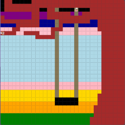

# Unit 1 - Asphalt Art

## Introduction

Cities use asphalt art to improve public safety, inspire their residents and visitors, and brighten communities. Your goal is to create asphalt art to revitalize The Neighborhood and bring the community together with the help of the Painter.

## Requirements

Use your knowledge of object-oriented programming, algorithms, the problem solving process, and decomposition strategies to create asphalt art:
- **Create a new subclass** – Create at least one new subclass of the PainterPlus class that is used for a component of the asphalt art design.
- **Plan an algorithm** – Use the problem solving process and decomposition strategies to plan an algorithm that incorporates a combination of sequencing, selection, and/or iteration.
- **Write a method** – Write at least one method in a PainterPlus subclass that contributes to a component of the asphalt art design.
- **Document your code** – Use comments to explain the purpose of the methods and code segments.

## Notes: Neighborhood & Painter Class

This project was created on Code.org's JavaLab platform using the built in Neightborhood GUI output. To test and edit this project you must build in Code.org's JavaLab with the Neighborhood GUI enabled. For reference to the Painter class documentation, [you can read more here.](https://studio.code.org/docs/ide/javalab/classes/Painter)

## Output:

 /

## Reflection

1. Describe your project.

   - I made a sunset photo with a large oak tree that had a tire swing fastened to it. I decided to make this peice because it really resonated with me as someone who loves nature and the outdoors. Also, as a colorblind person, I have a certain admirability for colors and I have artistic tendensies.

2. What are two things about your project that you are proud of?

   - This is my first project where I was mostly on my own, usually I have a partner or my teacher help me a lot, but this time I had a lot of time to hit and miss with this peice. 

3. Describe something you would improve or do differently if you had an opportunity to change something about your project.

   - I would probably make the background more of a gradient then a harsh color to color blocked out backround, I feel like it really takes away from the soft feeling of the sunset in the background. 